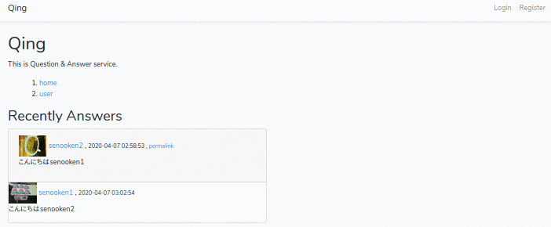
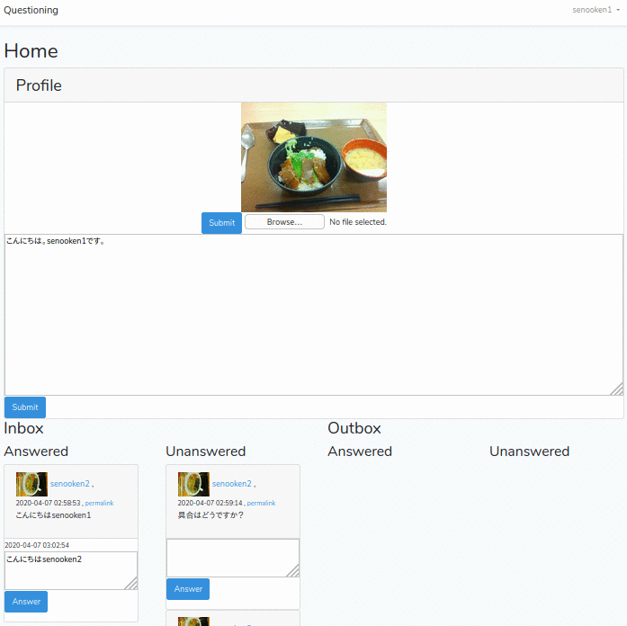
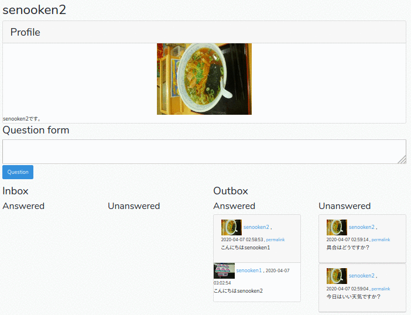

# Questioning


Questioning is question and answer web application developed by Laravel 6 + PHP 7.

[Demo](https://questioning.cf): ID=contact@example.com, PW=anonymous

## Screenshot
### Top (`/`)

### Home (`/home`)


### User (`/user/senooken2`)


## Usage
1. Rregister your account in `/register`.
2. Upload avatar and fill profile in `/home` after login.
2. Find user in `/user`, then ask question or view answer.
3. Answer your question in `/home/`.

## Dependency
- PHP 7.3+
- Composer
- Laravel 6.x
- npm

## Installation
```
git clone https://github.com/senooken/questioning
cd questioning
composer install
npm install && npm run dev
php artisan key:generate
touch database/database.sqlite
chmod -R a+rwx database
cp .env.example .env
php artisan migrate
```

In .env file, Fill following item.

- APP_NAME: Site name
- APP_DEBUG: false
- APP_URL: Site URL
- DB_CONNECTION: sqlite or mysql etc.
- DB_DATABASE: Comment out if use sqlite

```
APP_NAME=Questioning
APP_ENV=local
APP_KEY=
APP_DEBUG=false
APP_URL=https://domain

LOG_CHANNEL=stack

# DB_CONNECTION=mysql
DB_CONNECTION=sqlite
DB_HOST=127.0.0.1
DB_PORT=3306
# DB_DATABASE=laravel
DB_USERNAME=root
DB_PASSWORD=
```

## Attribution
- Author: SENOO, Ken
- License: CC0
